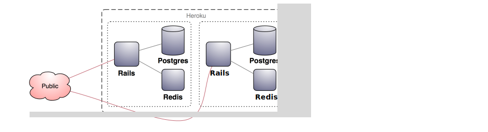
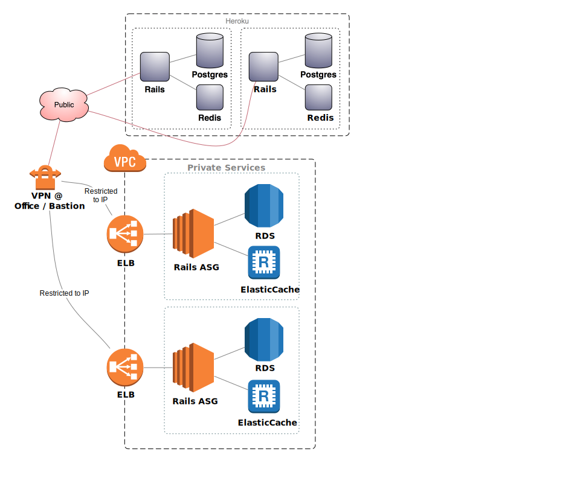
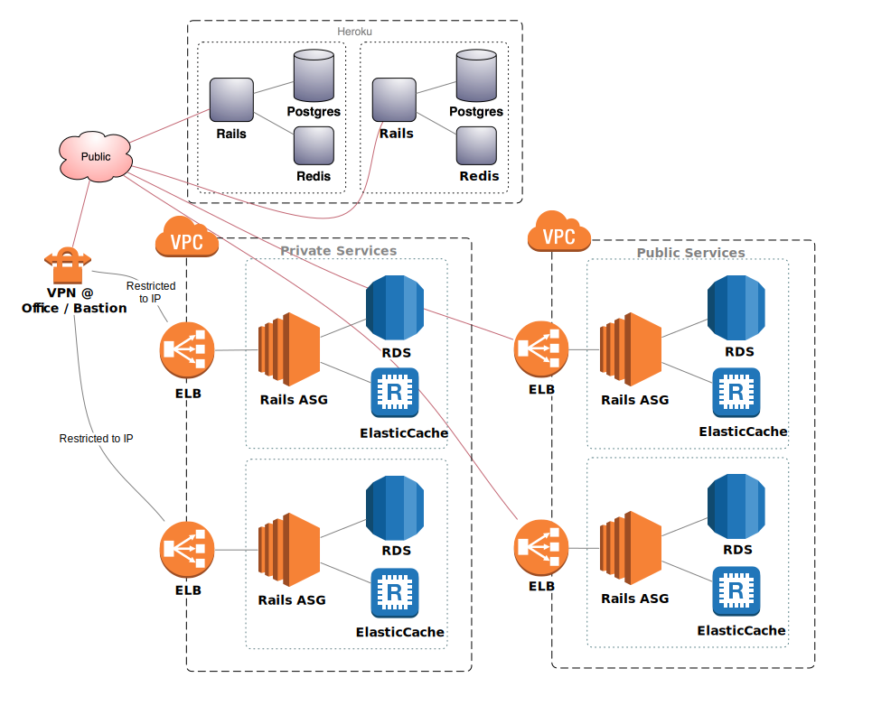
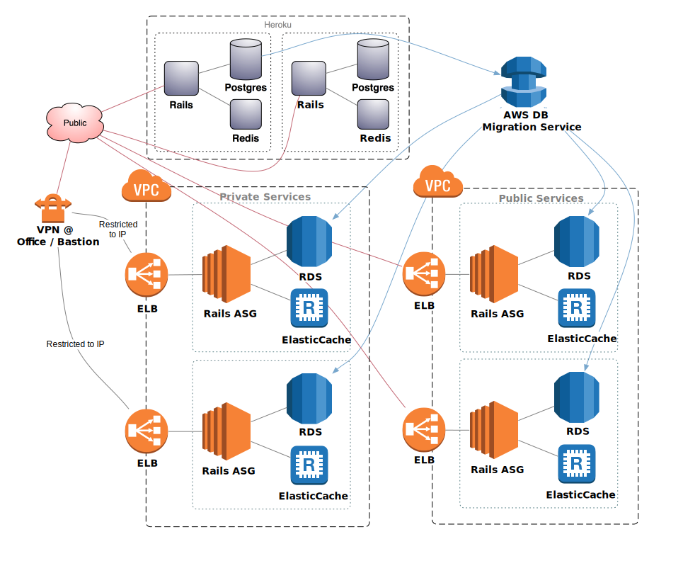
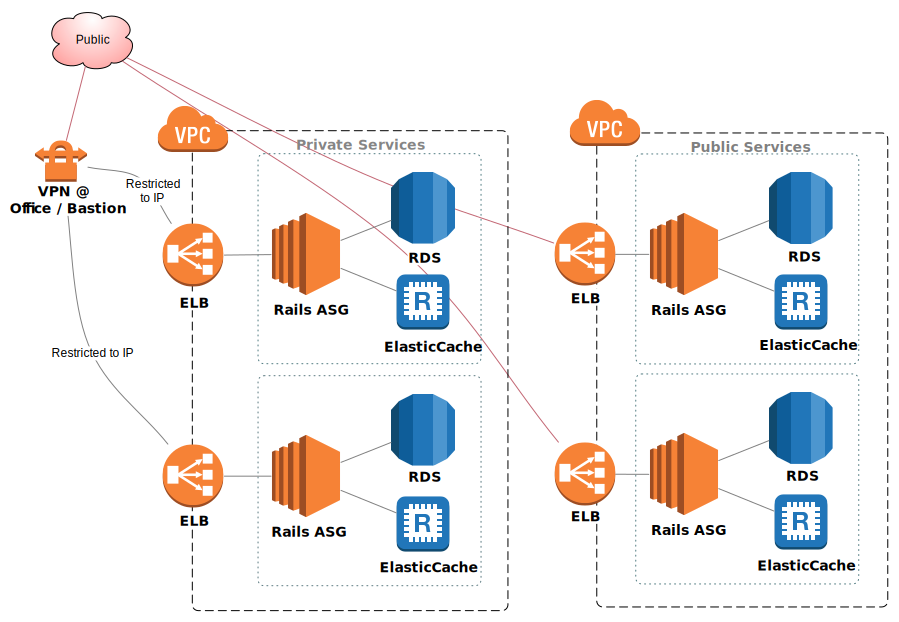
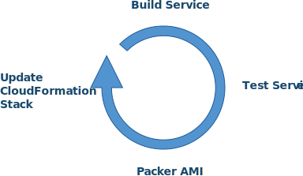

title: Stitch Fix Project
output: index.html
controls: true
theme: select/cleaver-select-theme
style: style.css

--

# Stitch Fix Project
## Andy Buecker

--

### Requirements:

* Migrate Heroku Rails services to AWS
* Support both public and private services
* Migrate database from Heroku to AWS
* Each service has its own database and cache
* No down time

--

### Heroku

**Very** rough assumption of the Heroku setup.

--

### AWS Private Services

Stand up a private AWS stack along side of Heroku.

VPC Security Groups are used to restricted access to specific location IP's.

Disable allocation of Public IP's on the subnets.

Load balancers distribute the traffic to the Rails services that are managed by
Auto Scaling Groups.

The Rails services have their own auto scaled RDS for postgres and ElasticCache
for Redis.

--

### AWS Public Services

The public stack is similar to the private stack, but has publicly accessible
ELB's.

--

### Database Migration

The AWS Migration Service continually replicates the Heroku Postgres databases
to RDS.

--

### Teardown

When the services on AWS pass integration tests, swap the DNS from Heroku to
AWS.

Eventually, teardown the Heroku services and AWS Migration Service.

-- p50

### Auto Scale

When load on the services increases or decreases, AWS automatically manages
the scaling of the nodes to stay within a minimum and maximum node count.

* Auto Scaling Groups for the Rails service instances.
* RDS for the Postgres
* ElasticCache for Redis

-- p75

### Deployment

As part of the continuos delivery process for each service, Packer builds an
AMI of the service.

CloudFormation then updates the stack with the new AMI.

-- w128

# That's it.  Simple.
## https://github.com/abuecker/sf-test

